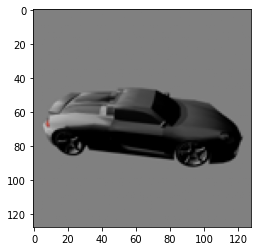
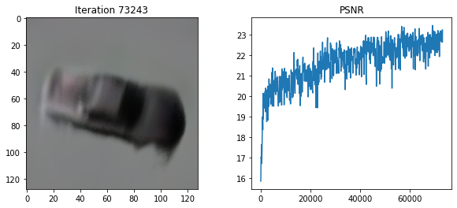

# PyTorch NeRF and pixelNeRF

**NeRF**: [](https://colab.research.google.com/drive/1oRnnlF-2YqCDIzoc-uShQm8_yymLKiqr)

**Tiny NeRF**: [](https://colab.research.google.com/drive/1ntlbzQ121-E1BSa5EKvAyai6SMG4cylj)

**pixelNeRF**: [](https://colab.research.google.com/drive/1VEEy4VOVoQTQKo4oG3nWcfKAXjC_0fFt)

This repository contains minimal PyTorch implementations of the NeRF model described in "[NeRF: Representing Scenes as Neural Radiance Fields for View Synthesis](https://arxiv.org/abs/2003.08934)" and the pixelNeRF model described in ["pixelNeRF: Neural Radiance Fields from One or Few Images"](https://arxiv.org/abs/2012.02190).
While there are other PyTorch implementations out there (e.g., [this one](https://github.com/krrish94/nerf-pytorch) and [this one](https://github.com/yenchenlin/nerf-pytorch) for NeRF, and [the authors' official implementation](https://github.com/sxyu/pixel-nerf) for pixelNeRF), I personally found them somewhat difficult to follow, so I decided to do a complete rewrite of NeRF myself.
I tried to stay as close to the authors' text as possible, and I added comments in the code referring back to the relevant sections/equations in the paper.
The final result is a tight 355 lines of heavily commented code (301 sloc—"source lines of code"—on GitHub) all contained in [a single file](run_nerf.py). For comparison, [this PyTorch implementation](https://github.com/krrish94/nerf-pytorch) has approximately 970 sloc spread across several files, while [this PyTorch implementation](https://github.com/yenchenlin/nerf-pytorch) has approximately 905 sloc.

[`run_tiny_nerf.py`](run_tiny_nerf.py) trains a simplified NeRF model inspired by the "[Tiny NeRF](https://colab.research.google.com/github/bmild/nerf/blob/master/tiny_nerf.ipynb)" example provided by the NeRF authors.
This NeRF model does not use fine sampling and the MLP is smaller, but the code is otherwise identical to the full model code.
At only 153 sloc, it might be a good place to start for people who are completely new to NeRF.
If you prefer your code more object-oriented, check out [`run_nerf_alt.py`](run_nerf_alt.py) and [`run_tiny_nerf_alt.py`](run_tiny_nerf_alt.py).

A Colab notebook for the full model can be found [here](https://colab.research.google.com/drive/1oRnnlF-2YqCDIzoc-uShQm8_yymLKiqr?usp=sharing), while a notebook for the tiny model can be found [here](https://colab.research.google.com/drive/1ntlbzQ121-E1BSa5EKvAyai6SMG4cylj?usp=sharing).
The [`generate_nerf_dataset.py`](generate_nerf_dataset.py) script was used to generate the training data of the ShapeNet car (see "[Generating the ShapeNet datasets](#generating-the-shapenet-datasets)" for additional details).

For the following test view:


[`run_nerf.py`](run_nerf.py) generated the following after 20,100 iterations (a few hours on a P100 GPU):

**Loss**: 0.00022201683896128088


while [`run_tiny_nerf.py`](run_tiny_nerf.py) generated the following after 19,600 iterations (~35 minutes on a P100 GPU):

**Loss**: 0.0004151524917688221


The advantages of streamlining NeRF's code become readily apparent when trying to extend NeRF.
For example, [training a pixelNeRF model](run_pixelnerf.py) only required making a few changes to [`run_nerf.py`](run_nerf.py) bringing it to 368 sloc (notebook [here](https://colab.research.google.com/drive/1VEEy4VOVoQTQKo4oG3nWcfKAXjC_0fFt?usp=sharing)).
For comparison, [the official pixelNeRF implementation](https://github.com/sxyu/pixel-nerf) has approximately 1,300 pixelNeRF-specific (i.e., not related to the image encoder or dataset) sloc spread across several files.
The [`generate_pixelnerf_dataset.py`](generate_pixelnerf_dataset.py) script was used to generate the training data of ShapeNet cars (see "[Generating the ShapeNet datasets](#generating-the-shapenet-datasets)" for additional details).

For the following source object and view:



and target view:


[`run_pixelnerf.py`](run_pixelnerf.py) generated the following after 73,243 iterations (~12 hours on a P100 GPU; the full pixelNeRF model was trained for 400,000 iterations, which took six days):

**Loss**: 0.004468636587262154



The "smearing" is an artifact caused by the bounding box sampling method.

## Generating the ShapeNet datasets

1) Download the data (the ShapeNet server is pretty slow, so this will take a while):

```bash
SHAPENET_BASE_DIR=<path/to/your/shapenet/root>
nohup wget --quiet -P ${SHAPENET_BASE_DIR} http://shapenet.cs.stanford.edu/shapenet/obj-zip/ShapeNetCore.v2.zip > shapenet.log &
```

2) Unzip the data:

```bash
cd ${SHAPENET_BASE_DIR}
nohup unzip -q ShapeNetCore.v2.zip > shapenet.log &
```

3) ***After*** the file is done unzipping, remove the ZIP:

```bash
rm ShapeNetCore.v2.zip
```

4) Change the `SHAPENET_DIR` variable in [`generate_nerf_dataset.py`](generate_nerf_dataset.py) and [`generate_pixelnerf_dataset.py`](generate_pixelnerf_dataset.py) to `<path/to/your/shapenet/root>/ShapeNetCore.v2`.
